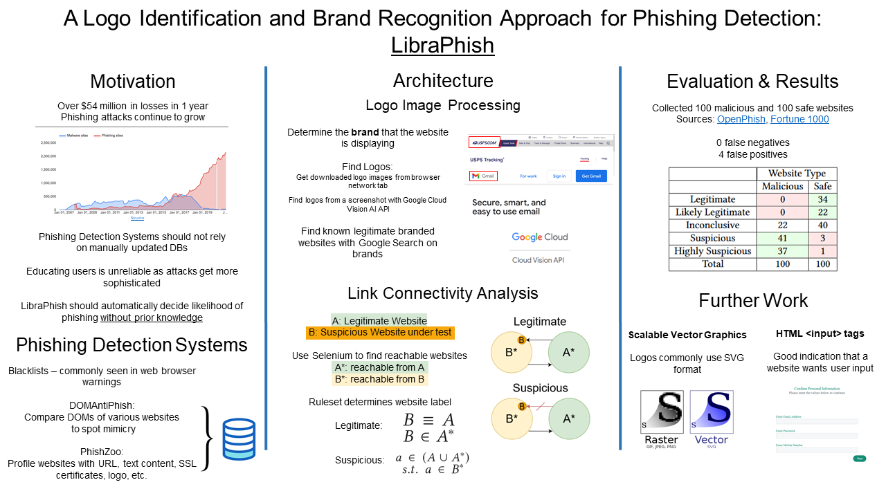

# A Logo Identification and Brand Recognition Approach for Phishing Detection (LibraPhish)

## Introduction
LibraPhish (Logo Identification and Brand Recognition
Approach for Phishing Detection) is a phishing detection system that uses
image processing on business logos and brands and graph
reachability analysis to determine if a website is part of a
phishing campaign and what the corresponding legitimate
website would be. 
Unlike existing phishing detection systems, LibraPhish does not require a maintained
denylist of malicious websites nor does it use any stateful systems like databases.  

## Overview
A more detailed explanation of LibraPhish can be found in `LibraPhish_Paper.pdf`.

## Installation Procedure
1. Create a [Google Cloud account](https://cloud.google.com) and enable the [Vision AI API](https://cloud.google.com/vision). Follow the CLI or SDK setup instructions.
2. Install [miniconda](https://docs.conda.io/en/latest/miniconda.html) and create a new environment with the requirements in `conda-env.txt` with  
`conda create --name <env> --file conda-env.txt`  
3. Run LibraPhish with `python main.py`.

